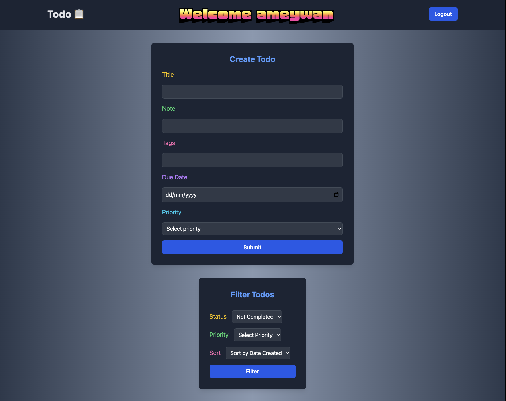
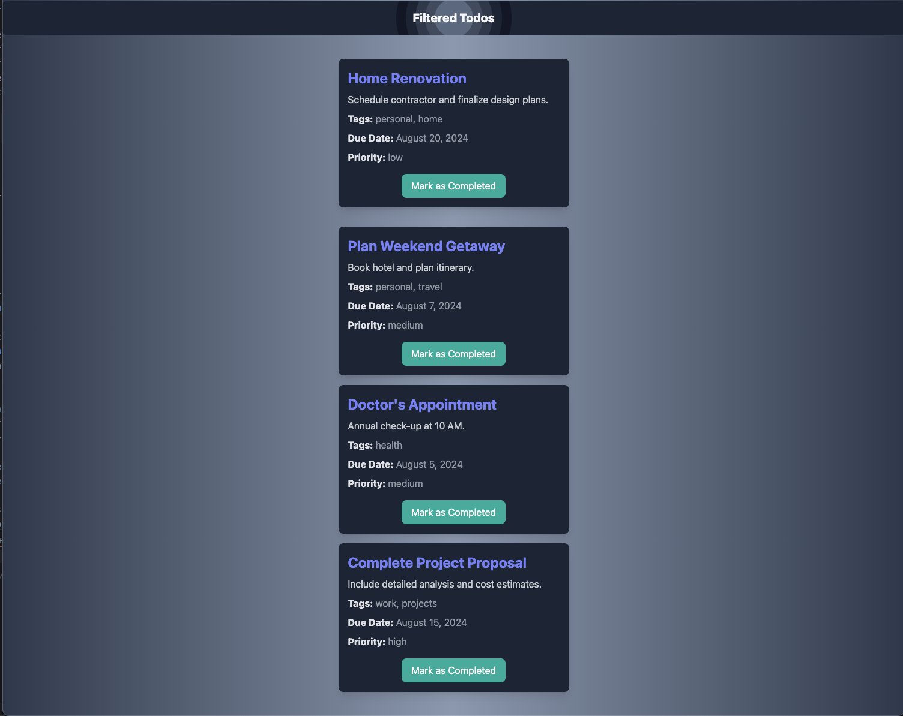
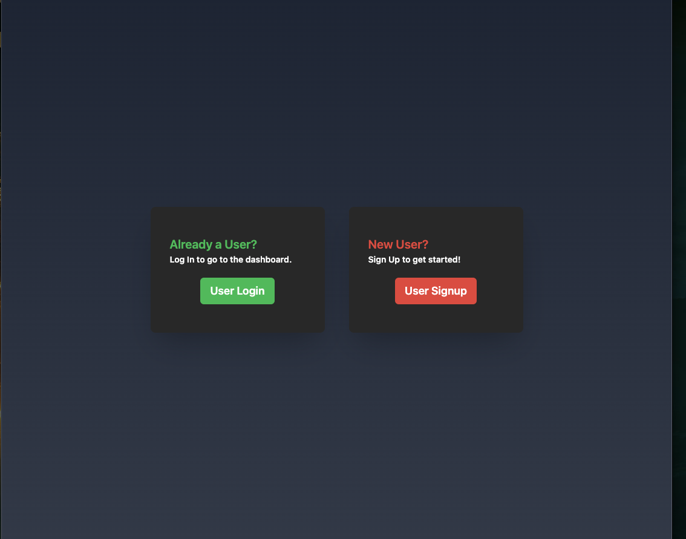
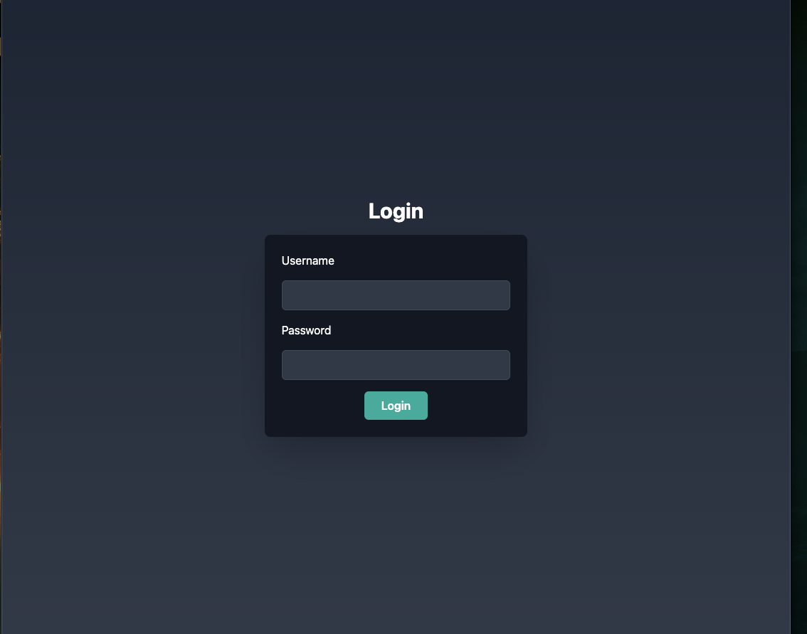
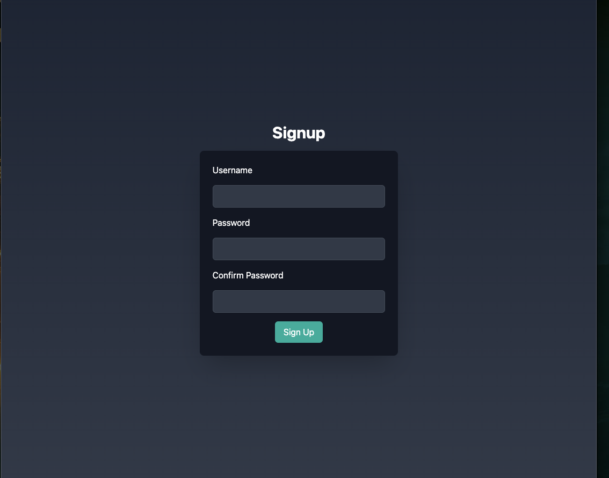

# Todo Application

This Todo application is meticulously crafted using the MERN stack. It offers a comprehensive set of features for managing tasks and user sessions. Below is an overview of its capabilities and the technologies used in both the backend and frontend.

## Features

- **User Management**: Ability to create users, login, and signup.
- **Todo Management**: Create, mark todos as completed, filter, and sort todos based on priority, completed status and date created.
- **User Persistence**: Remembers users and their todos.
- **Logout**: Secure logout functionality.

## Technologies Used

### Backend

- **Express**: Implemented HTTP server functionality.
- **Node.js**: Used as the runtime environment for the backend.
- **MongoDB**: Database for storing user and todo data.
- **Zod**: Schema validation layer to minimize unnecessary network requests.
- **Bcrypt**: Used for hashing passwords to enhance security.
- **JWT (JSON Web Tokens)**: Authentication layer for secure user sessions.
- **Error Handling Middleware**: Comprehensive error handling for robust application stability.
- **Modular Approach**: Utilized `.env` files and modular structure for better abstraction and security.

### Frontend

- **React**: Core library for building the user interface.
- **React Router DOM**: For multi-page client-side routing.
- **Tailwind CSS**: Styling framework for a consistent look across the UI.
- **Recoil**: State management library for efficient state handling, using atoms and selectors.
- **Formik**: Library for managing forms and validation.
- **Moment.js**: For handling and formatting dates in the application.
- **Axios**: For data fetching and HTTP requests.
- **React Hooks**: Utilized `useEffect`, `useState`, and `useRef` for managing component state and side effects.
- **Error Routing**: Smart error handling by routing errors to a dedicated error page.

## Some Screenshots

### Dashboard

### Home, Login, Signup

